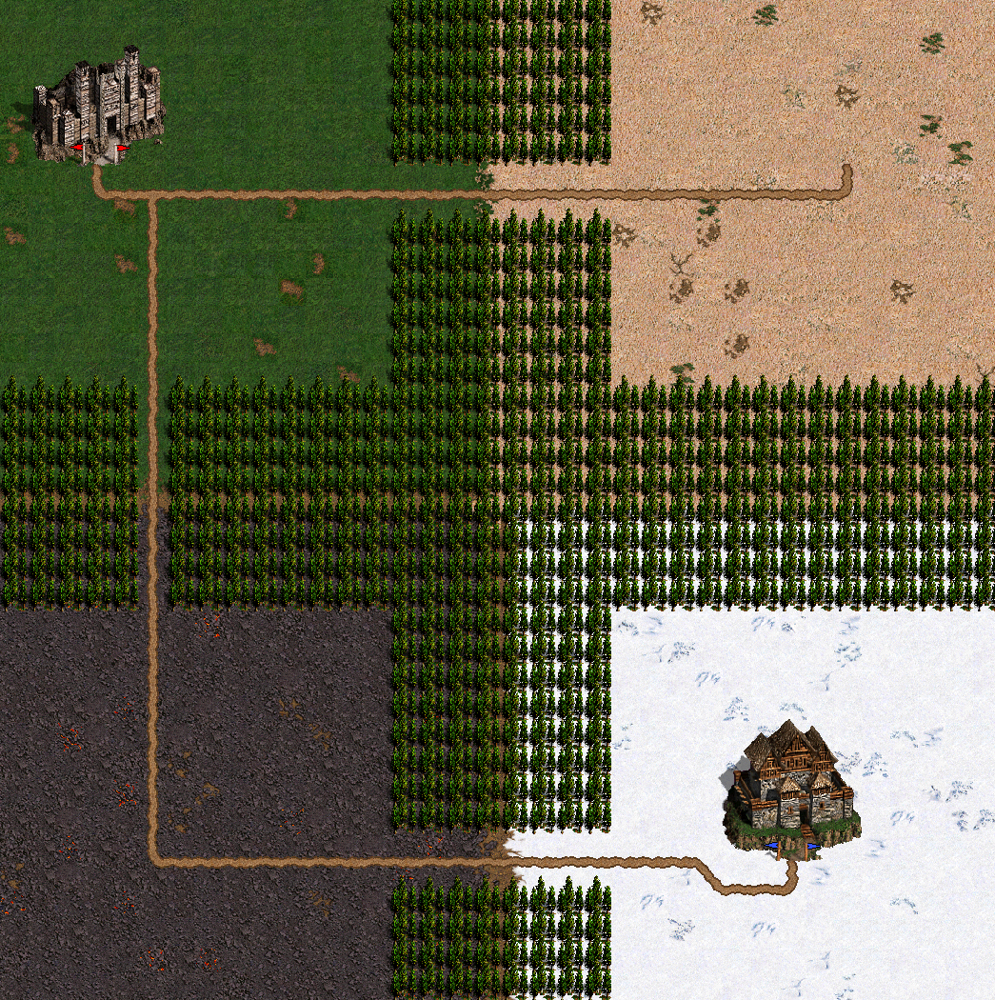
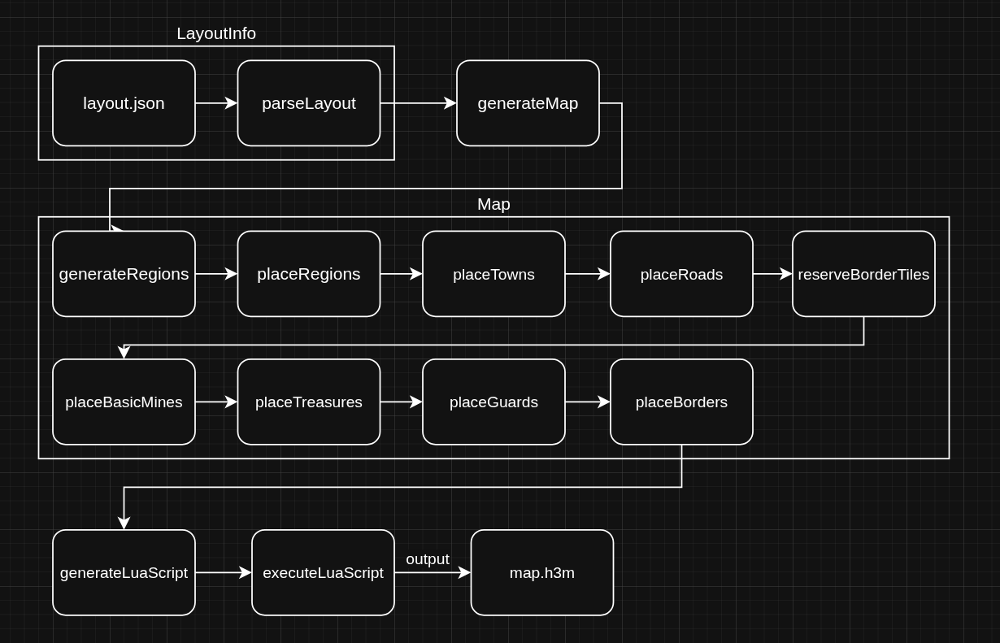

# HoMM3-MapGen-v2

## Init submodules
`git submodule update --recursive --init`

## Prerequisites
* `Lua5.4`, `qt5-tools`, `boost`, `nlohmann`

On Ubuntu you can run the following command to install needed dependencies

`sudo apt-get install lua5.4 liblua5.4-dev libtbb-dev libsdl2-ttf-dev qttools5-dev libsdl2-mixer-dev libsdl2-image-dev nlohmann-json3-dev`

Also it may be useful to create symlink for lua5.4
```
sudo ln -s /usr/include/lua5.4 /usr/include/lua
sudo ln -s "$(pkg-config --variable=libdir lua5.4)/liblua5.4.so" /usr/lib/liblua.so
```

## Enable pre-commit:
```bash
pip install pre-commit
pre-commit install
```

To check if everything is ok, run:
```bash
pre-commit run --all-files
```

## Example simple map


## Current workflow [[Edit]](https://drive.google.com/file/d/1-MMLnWZAN6rIbZze4e9L3LROMtLD1h6V/view?usp=sharing)


