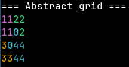
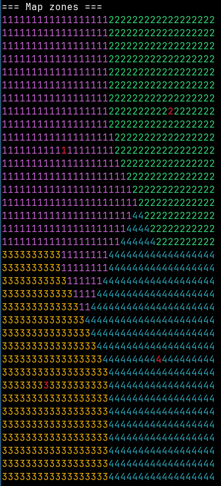

# Layout Based HoMM3 Map Generator
## Dawid Skowronek
## Grzegorz Kodrzycki

# Introduction to the problem, justification (both for the problem and methodology chosen)
Heroes of Might and Magic III map generation tools are limited, and many existing generators produce maps that are unbalanced or lack long-term replayability. This project implements a layout-based map generator for HoMM3 that aims to produce varied, playable, and balanced maps while avoiding forced symmetry.

Key goals:
- Generate balanced yet varied maps suitable for competitive and casual play.
- Preserve interesting strategic decision points while preventing unfair starting advantages.
- Provide extensibility through Lua scripting and a modular C++ architecture for experimentation.

Methodology:
We use a layout-based approach: predefined high-level templates define overall map structure, while procedural placement fills in local content such as resources, creatures, and towns. This hybrid method gives predictable macro-structure for balance, combined with local randomness to keep maps engaging and replayable.

# Background, literature
## Background
Our earlier engineering thesis explored template-based map generation for Heroes of Might & Magic III and produced useful insights about balance, macro-structure and overall project architecture.
After reviewing those results we identified opportunities for improvements.

## Literature
[1] J. Kowalski, R. Miernik, P. Pytlik, M. Pawlikowski, K. Piecuch and J. Sękowski, “Strategic Features and Terrain Generation for Balanced Heroes of Might and Magic III Maps,” 2018 IEEE Conference on Computational Intelligence and Games (CIG)

[2] G. Kodrzycki, D. Skowronek, "Designing a Template-Based Map Generator for Heroes of Might & Magic III"  https://jakubkowalski.tech/Supervising/Skowronek2025DesigningTemplateBased.pdf

[3] Gus Smedstad "The Heroes 3 Random Map Generator"
https://www.dropbox.com/scl/fi/p6oadqz10bu4i24ieytba/
heroes-3-random-map-generator-gus-smedstad.ppt?rlkey=
v6rt1qcht4a0s205a9lvokvr7

[4] Songs of Conquest "Random Map Generator Modding"
https://www.songsofconquest.com/modding/rmg

[5] homm3tools repository https://github.com/potmdehex/homm3tools

[6] homm3lua repository https://github.com/radekmie/homm3lua


# Methodology, experiments and results

The primary change from our earlier work is splitting the template into two levels: a high-level "layout" and a low-level "blueprint." The layout defines the map's macro-structure (zones, connections, types, and difficulty), while the blueprint specifies the contents of each zone (objects, resource richness, etc.). This separation improves usability and makes it easier to exchange and reuse templates.

We also introduce the abstraction of "regions": groups of zones that help control pacing and balance across larger map areas.

Additionally, we refactored low-level abstractions: `Tile` is now represented by an enum. This makes debug output more readable, simplifies serialization and deserialization between C++ and Lua, and enables explicit validation of tile states (detecting invalid or unsupported types early). The enum-based representation also standardises how tile types are compared and logged across the codebase.

Worth noting addition is `generator/global/GridSearch.hpp` which provides a set of generic, header-only search and claiming utilities used throughout the generator. The APIs are template-based and accept caller-provided `neighbors` and `passable` callables so they work with different connectivity rules and map representations.

## Zone generation
### Previous approach
We constructed an abstract grid $N \times N$ (where $N^2 \geq$ number_of_zones) and placed zone centers greedily, minimizing distance between connected zones and maximizing distance between unrelated zones. We then ran the Fruchterman–Reingold force-directed algorithm to improve center placement. Finally, tiles on the physical map were assigned to the nearest zone center (using BFS / nearest-center assignment). Center of zone was its center of mass.

### Failed attempts
Reusing the same placement procedure revealed a shortcoming: the algorithm ignored zone sizes, which produced uneven and poorly shaped zones.

### Final approach
We retain the abstract $N \times N$ grid but treat zones as weighted chunks (S = 1, M = 2, L = 3). We require
$N^2 \geq \sum_{z\in zones} size(z)$
so the grid can accommodate all zone area weights. Placement proceeds by seeding the first chunk greedily, then growing each chunk by claiming neighboring abstract cells probabilistically based on distance and remaining size until the target size is reached. After mapping the abstract grid onto the physical map we claim tiles immediately; any unclaimed tiles are assigned to the nearest zone center. Center of zone is tile with the smallest sum of distances to other tiles within zone.

This weighted-chunk approach produces better-shaped zones and gives explicit control over relative zone sizes.

#### Filled abstract grid


#### Filled map zones (red number represent zone center)



## Town Generation
### Previous approach
We were placing towns on the zones centers.
### Final result
Method is the same, but with respect to the new code architecture (we modify tiles accordingly to town' size and entrance).

## Border Generation
### Previous approach
Border tiles were defined as tiles that had a neighbour from a different zone within a specified distance. During this step we also identified candidate "gates" - locations where zones will be connected.
### Final result
We now classify border tiles into two roles: `inner` and `outer`. An `inner` border tile directly neighbours a tile from another zone and represents the "core" of the border. An `outer` border tile is any tile within a configurable radius of an `inner` tile. We are not choosing gate in this approach.

## Road Generation
### Previous approach
We connect two chosen points (towns or town and zone center) with the shortest path using Dijkstra.
### Final result
The method is the same, but we are using algorithms defined in `GridSearch.hpp`.

## Mine Placement
### Previous approach
We placed basic mines independently within a given radius of the town.
### Final result
Mines are now placed as a related triple: `town`, `ore mine`, and `sawmill` are chosen so their positions approximately form a triangle with a controlled perimeter. The triangle constraint reduces starting-location bias by keeping pairwise distances balanced. In previous approach we ignored distance between mines, which could lead to imbalance.

If no suitable triple is found within 10000 tries, the generator will fail.

## Guard Placement
### Previous approach
Guards were placed at predetermined locations (gates and next to mine entrances). Tier and count were chosen randomly (within a range tied to zone difficulty) without considering the actual combat strength of the selected units.
### Final result
Guards are still placed near mines. Border guards are placed on tiles that maximise local border coverage (the tile with the most `inner` border neighbours). For balance we use the original HoMM3 `fight_value` metric (defined per unit) to measure strength. Each guard type has an explicit strength profile; we pick a tier from a configured range (tier ranges depend on guard type), select a concrete unit from that tier, then compute the quantity required to reach a target `fight_value`. We find this approach much more balanced.

## Treasure Placement
### Previous approach
We generated random rectangles and sprinkled random treasures inside them, then placed obstacles around them and guard at the entrance.
### Final result
We implemented an API to place treasures. On branch we implemented logic which randomly chooses number of treasures to be placed (based on `richness` definied in blueprint) within zone.

# How to run your code
## Init submodules
`git submodule update --recursive --init`

## Prerequisites
* `Lua5.4`, `qt5-tools`, `boost`, `nlohmann`, `magic-enum`

On Ubuntu you can run the following command to install needed dependencies

`sudo apt-get install lua5.4 liblua5.4-dev libtbb-dev libsdl2-ttf-dev qttools5-dev libsdl2-mixer-dev libsdl2-image-dev nlohmann-json3-dev libmagicenum-dev`

Also, it may be useful to create a symlink for lua5.4 installed in previous step
```
sudo ln -s /usr/include/lua5.4 /usr/include/lua
sudo ln -s "$(pkg-config --variable=libdir lua5.4)/liblua5.4.so" /usr/lib/liblua.so
```

## Running generator
```
make
./Generator [--seed <number>] [--location <path>]
```

# Conclusions

### Overview
- Implemented a layout + blueprint pipeline separating macro-structure (layout) from per-zone content (blueprint), improving template reusability and control over balance.
- Replaced center-based zone assignment with a weighted-chunk abstract grid and probabilistic growth to produce size-aware zones.
- Added `generator/global/GridSearch.hpp` — a header-only set of utilities used across placement and pathfinding code.
- Introduced an enum-based `Tile` representation to improve debug output and to enable easier validation during generation.
- Refactored placement subsystems (towns, roads, mines, treasures, guards) to use the new abstractions and prioritise balance and connectivity.

### Future work (short list)
- Extend usage of layout and blueprint
- Preparing architecture for mutation
- Obstacle generation (noise, cellular automata)
- Better treasure/mine  placement
- Natural look of biomes

# Any number of appendices containing more useful information / images / results
## Example simple map


## Current workflow

